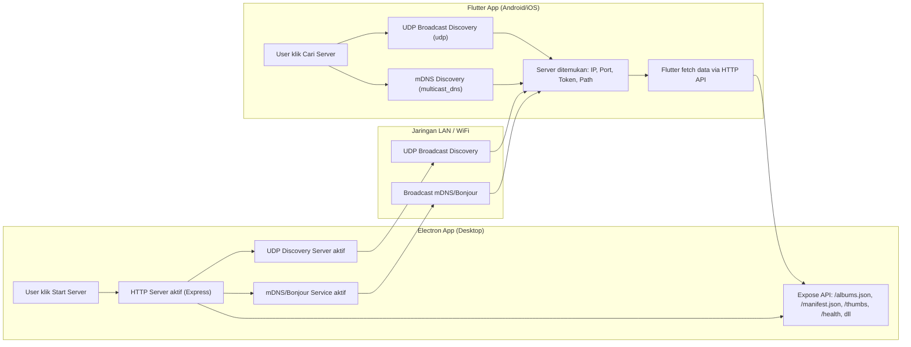

# DigiKam Sync App (Electron)

Aplikasi Electron + TypeScript untuk membaca database DigiKam (SQLite), mengekspor struktur album, metadata, dan thumbnail ke folder sinkronisasi (misal Syncthing). Mendukung discovery server otomatis dari aplikasi mobile (Flutter) via mDNS/Bonjour dan UDP broadcast.

---

## Fitur Utama

- Baca database DigiKam (.db) secara manual dari file picker
- Ekspor `albums.json`, `manifest.json`, dan thumbnail ke folder output
- Sinkronisasi dengan aplikasi mobile/LibrePhotos/Flutter Gallery Viewer
- Discovery server otomatis via mDNS/Bonjour dan UDP broadcast
- QR code pairing untuk koneksi manual
- Progress bar dan log aktivitas di UI
- Mode offline (semua dijalankan di lokal)

---

## Requirement

- **OS:** Windows 10/11, Linux, macOS
- **Node.js:** >= 20.x
- **Electron:** ^31.x
- **npm:** >= 9.x
- **sqlite3:** `npm install sqlite3`
- **sharp:** `npm install sharp`
- **bonjour:** `npm install bonjour`
- **express, cors, dgram:** (otomatis terpasang via package.json)
- **Vite + electron-forge:** untuk development & packaging

---

## Instalasi

1. **Clone repository**
   ```sh
   git clone https://github.com/yourusername/digikam-sync-app.git
   cd digikam-sync-app
   ```

2. **Install dependencies**
   ```sh
   npm install
   ```

---

## Menjalankan Aplikasi (Development)

1. **Start Electron (dev mode)**
   ```sh
   npm run dev
   ```
   - Electron window akan muncul.
   - Pilih database DigiKam dan folder output melalui UI.

2. **Server Discovery**
   - mDNS/Bonjour dan UDP server otomatis aktif saat server HTTP dinyalakan (setelah klik "Start Server").
   - Pastikan firewall tidak memblokir port HTTP dan UDP.

3. **Sinkronisasi Mobile**
   - Pastikan device mobile (Flutter) terhubung ke jaringan yang sama.
   - Jalankan aplikasi Flutter, klik "Cari Server" untuk otomatis menemukan server Electron.

---

## Menjalankan Aplikasi (Production Build)

1. **Build aplikasi**
   ```sh
   npm run make
   ```
   - Output installer ada di folder `out/`.

---

## Pengembangan

- **Source utama:**  
  - `src/main/server.ts` (HTTP server & API)
  - `src/services/electron-exporter.ts` (exporter, mDNS/UDP discovery)
  - `src/renderer/renderer.ts` (UI renderer)
  - `src/preload/preload.ts` (Electron preload bridge)
  - `src/index.html` (UI utama)

- **Menambah fitur baru:**  
  - Tambahkan kode di file terkait, lalu jalankan `npm run dev` untuk hot reload.

- **Debugging:**  
  - Cek log di Electron window dan terminal.
  - Gunakan browser/device lain untuk tes akses server dan endpoint `/health`.

---

## Troubleshooting

- Jika server tidak ditemukan dari Flutter:
  - Pastikan Electron server sudah berjalan dan discovery aktif.
  - Cek firewall dan port.
  - Pastikan jaringan WiFi/LAN sama.
  - Coba akses `http://<ip-server>:<port>/health` dari browser HP.

---


## Alur Kerja


- Electron App
  - User menekan tombol "Start Server" di Electron.
  - Electron menjalankan HTTP server (Express) dan mengaktifkan mDNS/Bonjour serta UDP Discovery.
  - Server mengiklankan dirinya di jaringan lokal via mDNS/Bonjour dan UDP.
  - Jaringan LAN
- Electron App
  - mDNS/Bonjour dan UDP broadcast mengumumkan keberadaan server ke seluruh perangkat di jaringan yang sama.
- Android/Mobile
  - User menekan tombol "Cari Server" di aplikasi Mobile Apps.
  - Mobile Apps melakukan discovery via mDNS dan/atau UDP broadcast.
  - Jika server ditemukan, Mobile Apps mendapatkan info: IP, port, token, path.
  - Mobile Apps kemudian melakukan request HTTP ke server Electron untuk mengambil data album, manifest, thumbnail, dll.


---

## Diagram Alur Koneksi

Lihat file `docs/diagram.md` atau gunakan diagram berikut:



### PlantUML diagram
[](https://editor.plantuml.com/uml/TPDDZjCm68Rtbdo7JsNJaJeK68q4rQYQf4aw_L69Q15BvCPkwubZHxOpW10tO87W09o1DPVY23Y9GwaqpUgDyto_RtnhBD6sAWH6LfLW5MoLjQe0oZNBB5SI8vDpMH9D2gYFYDmB1fyn0lU49CltMbMIJfHG-kOc5WxHIex7y2I-IbuaqHbmnUm7fVE6UvbSnw_ES8ceh6Mwvf8akOgVUKvfodJ3G2XSK7lyfetKacbuVetH5ummEdRT-_Fp-s_eUeIWBA4VCPExqIzwSDAz7p204RmrBbikU0wzTRqjM3Fzm7JFT-A8kyqczQT0Sijtq8y_bfePSz524mSLqMez39MyLvLkO9wnbcwPg2uLfH1naocNwTD9nfQ97UCoAyCWI6SZ61AnhGhpzDueEO1XGIJVCMExTtkeYgrnui28i8S1K24UMyhNRp0dciizaR0CLiDtFE7rFeuc-NKahdwe5Q4PCVPaelRxrCzmPFvDyrZT7x_0-zjw4KYg5QT3_dhT-74qtzU_ExLZufe-TMFc5_tV5lj59IolctbFPMV8_7oZqAzewR65mxmBb5jML3cH8vYb0qYLjWFOg9ovHQV47jg0fGleHjencns04alWWPFs9t6k-KK4S7avXX2Zi15n9oQTS3TdqeW4ewWHKupk6Z7hn1oZMICM6CqxaNHYseb58vOOBRjQjqnIT-l_0W00)
---

## Lisensi

MIT

---

## Kontribusi

Pull request dan issue sangat diterima!  
Silakan fork dan submit PR untuk fitur baru,